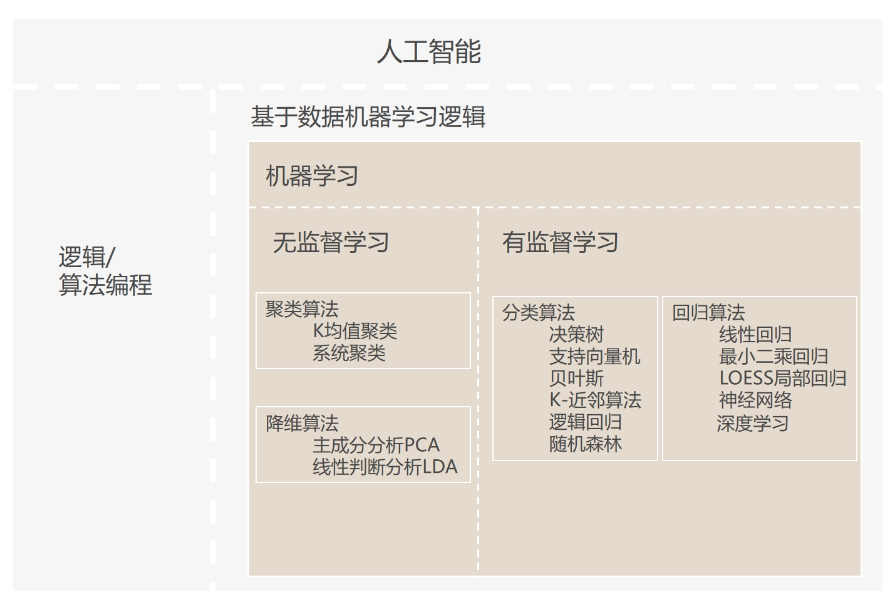

# 介绍和理解ANNS(blog)



### 宏观认识ANNS：
brute-force搜索的方式是在全空间进行搜索，为了加快查找的速度，几乎所有的ANN方法都是通过对全空间分割，将其分割成很多小的子空间，在搜索的时候，通过某种方式，快速锁定在某一（几）子空间，然后在该（几个）子空间里做遍历。

### ANNS实现方法：

树[^1]、哈希方法[^2]、矢量量化方法[^3]

#### 1.树
#### (1)KD树
[^1]:


划分标准 ： 求每一个维度的方差，选择方差最大的那个维度开始划分。

缺点 ： kd-trees are not suitable for efficiently finding the nearest neighbour in high dimensional spaces.
In very high dimensional spaces, the curse of dimensionality causes the algorithm to need to visit many more branches than in lower dimensional spaces. In particular, when the number of points is only slightly higher than the number of dimensions, the algorithm is only slightly better than a linear search of all of the points.

#### (2)Annoy(Spotify推荐系统)

核心：不断用选取的两个质心的法平面对空间进行分割，最终将每一个区分的子空间里面的样本数据限制在K以内。


```c++
struct ANNOY_NODE_ATTRIBUTE Node {
S n_descendants;
union {
  S children[2]; // Will possibly store more than 2
  T norm;
};
T dot_factor;
T v[1]; // We let this one overflow intentionally. Need to allocate at least 1 to make GCC happy保持原始特征
};
```

#### 2.哈希方法（典例代表局部敏感哈希）
[^2]:
#### (1)一些名词
<u>局部敏感</u> : 相近的样本点对比相远的样本点对更容易发生碰撞

<u>哈希加速查找</u>  ：首先找到查询样本落入哪个cell(桶)中，
如果空间的划分是在想要的相似性度量下进行分割的，
则查询样本的最近邻将极有可能落在查询样本的cell中
，如此只需要在当前的cell中遍历比较。

<u>多表哈希</u>  ：对于单表哈希，当哈希函数数目K取得太大，查询样本与其对应的最近邻落入同一个桶中的可能性会变得很微弱，针对这个问题，我们可以重复这个过程L次，从而增加最近邻的召回率。这个重复L次的过程，可以转化为构建L个哈希表，这样在给定查询样本时，我们可以找到L个哈希桶（每个表找到一个哈希桶），然后我们在这L个哈希表中进行遍历。这个过程相当于构建了K*L个哈希函数

<u>多表哈希中K,L如何选取</u>  : 哈希函数数目K和哈希表数目L,哈希函数数目K如果设置得过小，会导致每一个哈希桶中容纳了太多的数据点，从而增加了查询响应的时间；而当K设置得过大时，会使得落入每个哈希桶中的数据点变小，而为了增加召回率，我们需要增加L以便构建更多的哈希表，但是哈希表数目的增加会导致更多的内存消耗，并且也使得我们需要计算更多的哈希函数，同样会增加查询相应时间。这听起来非常的不妙，但是在K过大或过小之间仍然可以找到一个比较合理的折中位置。通过选取合理的K和L，我们可以获得比线性扫描极大的性能提升。

<u>Multiprobe </u> : 对于构建的L个哈希表，我们在每一个哈希表中找到查询样本落入的哈希桶，然后再在这个哈希桶中做遍历，而Multiprobe指的是我们不止在查询样本所在的哈希桶中遍历，还会找到其他的一些哈希桶，然后这些找到的T个哈希桶中进行遍历。
如果不使用Multiprobe，需要的哈希表数目L在100到1000之间，在处理大数据集的时候，其空间的消耗会非常的高，因为有了上面的Multiprobe的策略，LSH在任意一个哈希表中查找到最近邻的概率变得更高，从而能减少哈希表的构建数目。

<u>其他哈希桶的选取准则</u> ：跟查询样本所在的哈希桶邻近的哈希桶，“邻近”指的是汉明距离度量下的邻近。

<u>LSH</u>  ：
- K，每一个哈希表的哈希函数（空间划分）数目
- L，哈希表（每一个哈希表有K个哈希函数）的数目
- T，近邻哈希桶的数目，即the number of probes

根据可使用的内存大小选取L，然后在K和T之间做出折中：哈希函数数目K越大，相应地，近邻哈希桶的数目的数目T也应该设置得比较大，反之K越小，L也可以相应的减小。

获取K和L最优值的方式可以按照如下方式进行：对于每个固定的K，如果在查询样本集上获得了我们想要的精度，则此时T的值即为合理的值。在对T进行调参的时候，我们不需要重新构建哈希表，甚至我们还可以采用二分搜索的方式来加快T参数的选取过程。

#### (2)LSH开源工具包

<font color=" pink">LSHash</font>  

使用单哈希表，哈希函数的系数随机生成。

```c++
def _generate_uniform_planes(self):
    """ Generate uniformly distributed hyperplanes and return it as a 2D
    numpy array.
    """

    return np.random.randn(self.hash_size, self.input_dim)//hash_size为哈希函数的数目即K
```
<font color="pink">FALCONN</font>  

```c++
暂时未读懂，略
```

#### 3.矢量量化方法（vector quantization）

矢量量化方法 : 将一个向量空间中的点用其中的一个有限子集来进行编码的过程。

关键 ： 码本的建立和码字搜索算法

资料来源：
[ANN Search](https://yongyuan.name/blog/ann-search.html)