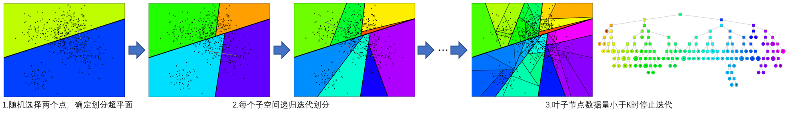
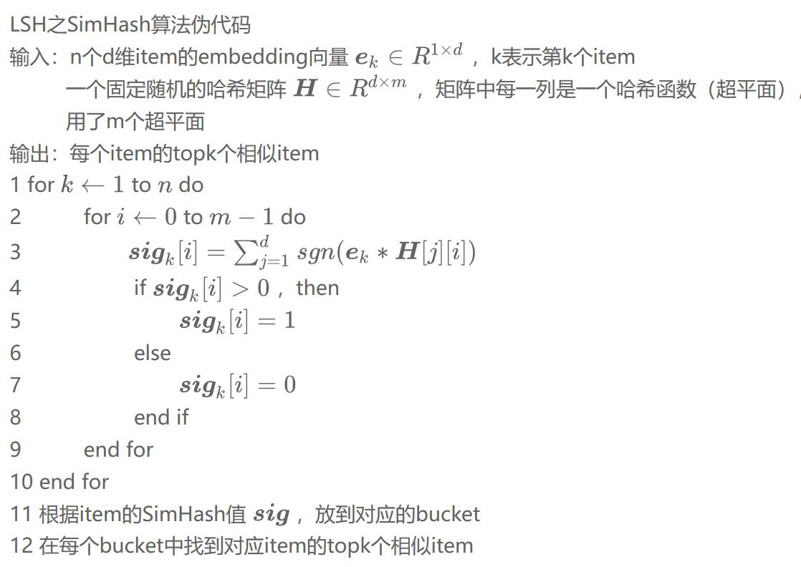
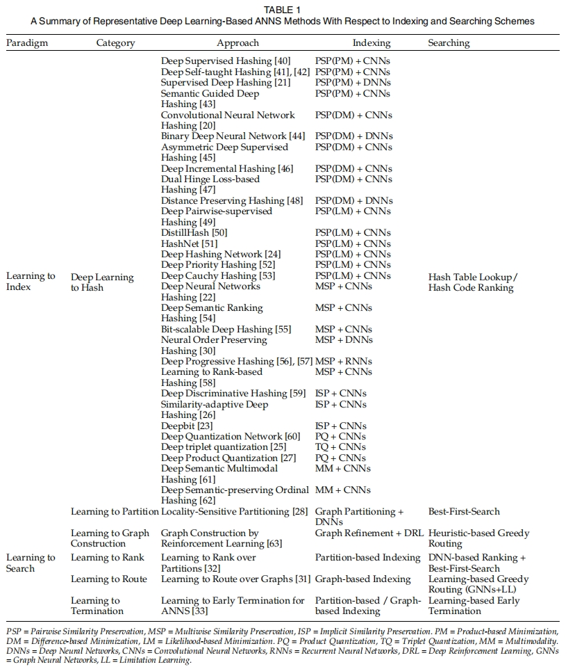

# 介绍和理解ANNS(papers)

## 一、ANNS实现思路：

- 基本思路：
    The ANNS methods usually first construct an index
    structure to organize data items and then perform a querying search algorithm based on this index to retrieve the
    nearest neighbour results for the given queries.

    通过牺牲一小部分的精度，换取几个量级检索速度提升。具体就是先将数据按某种形式安排，在后续查找可以加快查询效率。

- 基本方案：
    - 缩短距离计算的时间 ：量化
    - 减少距离计算的次数 ：树、哈希、图


- 根据 Indexing and Searching 的类型分类实现思路:
    Hashing-based、Parition-based、Graph-based、Compression-based

| category | Hashing-based                            | Parition-based                           | Graph-based                    | Compression-based[^4] |
|----------|------------------------------------------|------------------------------------------|--------------------------------|-----------------------|
|          | LSH (locality sensitive hash-based)[^3]  | KD-tree[^1]                              | KGraph                         | Faiss                 |
|          |                                          | Annoy[^2]                                | Small World Graph              | ScaNN                 |
|          |                                          | hierarchical k-means tree[^5]            | Navigating Spreading-out Graph |                       |
|          |                                          | random projection tree (heuristic-based) |                                |                       |

- advantage
    - Faster search
    - Don not necessarily have to exact neighbors
    - Trade off : runtime,accuracy,and memory-consumption
    - a sense of scale : billion-scale data on memory

## 二、树方法

[^1]: 
### KD树

- 基本思路：将数据按平面分割，用二叉树来代表每一分割的部分，便于后续搜索

- 建树过程：
    1. 沿着笛卡尔坐标，选择方差最大的维度进行划分
    2. 每个维度采用中位数作为划分点，划分并分配数据至叶子结点
    3. 每个叶子结点重复建树过程，直至叶子结点只有一个数据点

- 搜索过程：
    1. 依据二叉树搜索算法找到搜索点所在的叶子节点空间，计算叶子节点上的数据点与搜索点之间的距离，记作当前最短距离
    2. 回溯父结点，判断搜索点当前最短距离构成的超球体与父结点的另一个结点构成的超矩形是否相交，如果没有相交，继续回溯直至根节点，否则递归搜索另一个结点

- 优缺点：
     KD树因为有回溯的机制，它能够保证搜索回来的点是精确的，同时相比与线性查找，它计算距离的次数是减少了，但它只适合用于低维数据的检索，维度越高，搜索点当前最短距离构成的超球体与超矩形的相交概率越大，此时就趋近于线性的搜索。

[^2]:
### Annoy

- 建树过程：
    1. 随机选择两个点，确定划分超平面，划分为两个子空间
    2. 每个子空间按相同方式递归迭代划分，直至子空间数据量少于K
    
    - 可能出现的问题：
        - 如果我们想要 Top K 的点，但是该区域的点集数量不足 K，该怎么办？
        - 如果真实的 Top K 中部分点不在这个区域，该怎么办？
    - 解决办法：
        - 使用优先队列（priority queue）：将多棵树放入优先队列，逐一处理；并且通过阈值设定的方式，如果查询的点与二叉树中某个节点比较相似，那么就同时走两个分支，而不是只走一个分支
        - 使用森林（forest of trees）：构建多棵树，采用多个树同时搜索的方式，得到候选集 Top M（M > K），然后对这 M 个候选集计算其相似度或者距离，最终进行排序就可以得到近似 Top K 的结果
   

- 搜索过程：
    1. 将每一颗树的根节点插入优先队列
    2. 搜索优先队列中的每一颗二叉树，每一颗二叉树都可以得到最多 Top K 的候选集
    3. 删除重复的候选集
    4. 计算候选集与查询点的相似度或者距离
    4. 返回 Top K 的集合


## 三、哈希方法
[^3]:

### LSH（Locality-Sensitive Hashing,局部敏感哈希）

- 基本思路 : 
    通过一系列哈希函数将附近的点映射到同一个桶中，组成哈希表,构建多个独立的哈希表增加候选点数量，提升精度
    </br>(哈希函数满足局部敏感：两个点距离越近，哈希值相同概率越高)

- 搜索过程 : </br>把搜索点通过同样的哈希函数映射到某个桶里，对桶里的所有数据点求距离得到最近的数据点，因为只对一个桶里的数据做计算，而不是对所有数据计算，所以大大减少了距离计算的次数，提高了效率，而且因为同一个桶都是哈希敏感的，桶里的点大概率是相近的点，因此这种计算方式对精度的影响也不会很大；同时它可以通过构建多个哈希表的形式，把每个哈希表碰撞到的桶的数据做一个并集，再线性计算距离即可，避免出现单个哈希表把相近的数据点划分到不同桶里影响精度。

- 两种不同的LSH :  </br>
    * 使用Jaccard系数度量数据相似度时的min-hash
    * 使用欧氏距离度量数据相似度时的P-stable hash
    
    无论是哪种LSH，其实说白了，都是将高维数据降维到低维数据，同时，还能在一定程度上，保持原始数据的相似度不变。LSH不是确定性的，而是概率性的，也就是说有一定的概率导致原本很相似的数据映射成2个不同的hash值，或者原本不相似的数据映射成同一hash值。这是高维数据降维过程中所不能避免的（因为降维势必会造成某种程度上数据的失真），不过好在LSH的设计能够通过相应的参数控制出现这种错误的概率，这也是LSH被广泛应用的原因

<!--

- LSH的算法：
    * 基于Stable Distribution投影方法</br>
        产生满足Stable Distribution的分布进行投影，最后将量化后的投影值作为value输出。需要同时选择两个参数，并且量化后的哈希值是一个整数而不是bit形式的0和1，你还需要再变换一次。
    * 基于随机超平面投影的方法</br>
        提出了一种随机超平面投影LSH. 这种方法的最大优点在于：不需要参数设定;是两个向量间的cosine距离，非常适合于文本度量;计算后的value值是比特形式的1和0，免去了前面算法的再次变化
    * SimHash</br>
        前面介绍的LSH算法，都需要首先将样本特征映射为特征向量的形式，使得我们需要额外存储一个映射字典，难免麻烦，大神Charikar提出了SimHash算法，在满足随机超平面投影LSH特性的同时避免了额外的映射开销，非常适合于token形式的特征。 
        <pre>
        SimHash的计算过程： 
            a. 将一个f维的向量V初始化为0；f位的二进制数S初始化为0； 
            b. 对每一个特征：用传统的hash算法（哪种算法不重要，只要均匀就可以）对该特征产生一个f位的签名b。
                对i=1到f:如果b的第i位为1，则V的第i个元素加上该特征的权重；否则，V的第i个元素减去该特征的权重。 
            c. 如果V的第i个元素大于0，则S的第i位为1，否则为0； 
            d. 输出S作为签名。
        </pre>
        Pseudocode：

         

    * Kernel LSH
-->

- 实例:</br>
    k-shinging 和 one-hot编码将文本转换为稀疏向量，然后用最小哈希创建签名，签名被传递给LSH流程以剔除部分候选对
    1. Shingling：把文档转换成集合
    2. Minhashing：把大规模集合转换成短小签名，但是保留相关性
    3. LSH Query：计算可能相似的签名对,调节 M，b，r用相似的签名来得到所有的文档对，但是剔除那些并不相似的签名多数对，检查主要内存，候选对并没有相似签名。


资料来源：
[LSH的实现原理](https://www.pinecone.io/learn/series/faiss/locality-sensitive-hashing/)

代码实操：
[LSH Code](https://github.com/pinecone-io/examples)

论文参考

[1]M. Slaney and M. Casey, "Locality-Sensitive Hashing for Finding Nearest Neighbors [Lecture Notes]," in IEEE Signal Processing Magazine, vol. 25, no. 2, pp. 128-131, March 2008, doi: 10.1109/MSP.2007.914237.

[^4]:
### K-means Clustering

Pseudocode：

```
获取数据 n 个 m 维的数据
随机生成 K 个 m 维的点
while(t)
    for(int i=0;i < n;i++)
        for(int j=0;j < k;j++)
            计算点 i 到类 j 的距离
    for(int i=0;i < k;i++)
        1. 找出所有属于自己这一类的所有数据点
        2. 把自己的坐标修改为这些数据点的中心点坐标
end
```


## 四、矢量量化方法

## 五、图方法

### NSW (Navigable Small World Graph)

- 基本思路：
    1. 随机选择1个元素，放入到candidates当中
    2. 从candidates中选取最近邻节点c，将这些元素的邻居节点放置到q当中
    3. 从candidates中移除最近邻节点c
    4. 如果c的距离远大于result中的第k个节点，跳出循环
    5. 否则，对于c的每个邻居节点，遍历其邻居，如果没有在visited set里面。
    6. 将e加入到visited set， candidates， tempRes
    7. 遍历完成candidate中所有的节点后，把tempRes的结果传入到result
    8. 重复执行上述步骤m遍, 返回result中最优的k个近邻结果。

    ```
    K-NNSearch(object q,integer:m,k)
     TreeSet[object]tempRes, candidates, visitedSet, result
        for(i<-0; i< m; i++) do:
            put random entry point in candidates
            tempRes<-null
            repeat:
                get element c closest from candidates to q
                remove c from candidates
                #checks to p condition:
                if c is further than k-th element from result
                    than break repeat
                #update list of candidates:
                for every element e from friends of c do:
                    if e is not in visited Set than
                    add e to visited Set, candidates, tempRes
            end repeat
            #aggregate the results:
            add objects from tempRes to result
        end for
     return best k elements from result

    ```

### HNSW(Hierarchical Navigable Small World Graph)

资料来源:[NSW & HNSW](https://zhuanlan.zhihu.com/p/264832755)

Process：

1. 在Layer = 0 层中，包含了连通图中所有的点。
2. 随着层数的增加，每一层的点数逐渐减少并且遵循指数衰减定律
3. 图节点的最大层数，由随机指数概率衰减函数决定。
4. 从某个点所在的最高层往下的所有层中均存在该节点。
5. 在对HNSW进行查询的时候，从最高层开始检索。


输入：

输出：插入节点q后的hnsw网络结构

### Product Quantization

资料来源:
[Faiss](https://www.pinecone.io/learn/series/faiss/)
[PQ_BLOG](https://zhuanlan.zhihu.com/p/534004381)

代码实战:[PQ_TEST](https://github.com/xiaopp123/news_recommend_system/blob/main/recall/pq_test/pq.py)

process：
1. Taking a big, high-dimensional vector,
2. Splitting it into equally sized chunks — our subvectors,
3. Assigning each of these subvectors to its nearest centroid (also called reproduction/reconstruction values),
4. Replacing these centroid values with unique IDs — each ID represents a centroid


\\( \int x dx = \frac{x^2}{2} + C \\)


资料来源：

Deep Learning for Approximate Nearest Neighbour Search: A Survey and Future Directions




