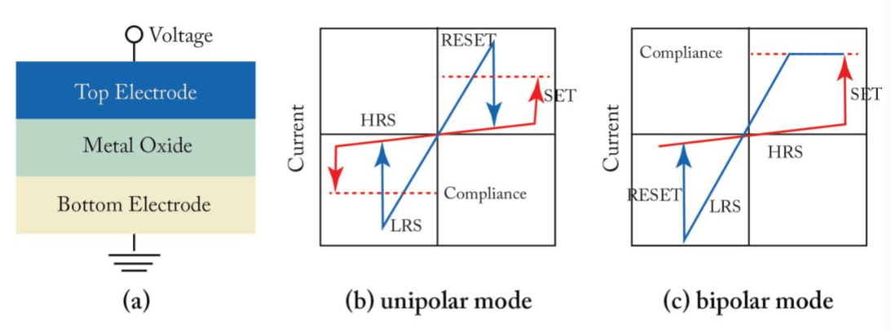
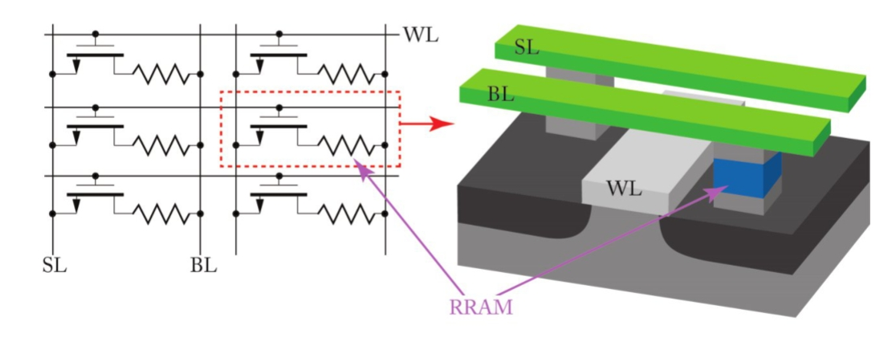
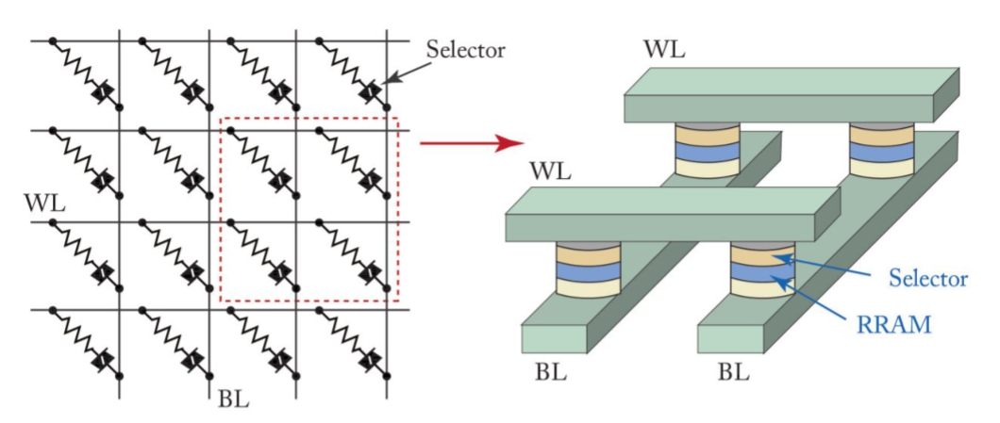

# 学习ReRAM

> 目录
> * RRAM技术的简介[^1]
> * RRAM设备的制备和性能[^2]
> * RRAM的表征与建模[^3]
> * RRAM阵列架构[^4]

资料来源：
[Resistive Random Access Memory(RRAM): From Devices to Array Architectures](https://www.doc88.com/p-4751311136546.html)

词汇总结

fabrication 制备

hierarchy 层次

stores the charge储存充能

cross-coupled inverters交叉耦合的反相器

cell capacitor 电容器单位

the floating gate of the transistor晶体管的浮栅

nanosacle纳米尺度

degradation 降低

[^1]:
## RRAM技术简介 

- 对传统存储器（SRAM、DRAM、FLASH）进行了简要的回顾。
- 介绍了非易失性存储器（non-volatile memory, NVM）RRAM的基本原理。
- 其基本原理是：
    - (1) 在未加电压时，由于电极间氧化层默认绝缘，RRAM两端为高阻抗状态（HRS）；
    - (2) 在两端加一电压，若该电压超过“形成电压”（forming voltage,\\( V_{form} \\) )时，则氧化层中间形成“导电纤维”（conductive filatment, CF），从而进入低阻抗状态（LRS）（比HRS约低三个数量级）；
    - (3)以双极型（bipolar）为例，若给处于LRS的RRAM两端加一反向的电压，器件将从LRS再次变为HRS。
- 将RRAM与市面上常见的存储器以及同属于NVM的其他的STT-MRAM、PCRAM做对比，强调了RRAM具有面积小、存取速度快、功耗极低的特点。

- RRAM基础

    

    - 氧化物材料：NiO、TiOx、HfOx等。
    - 电极材料：TaN或TiN。
    - 物理原理：基于氧空位（oxygen vacanciy，Vo）形成CF机理——另有一种基于金属原子形成CF机理的CBRAM。
    - 总结了可能用来充当氧化物介质和两端电极的材料（以一张元素周期表形式给出）。
    - 介绍了两种阻变模式：单极型 (unipolar)和双极型 (bipolar)——本书重点讲bipolar。

[^2]:
## RRAM设备的制备和性能
- 器件制备
    - 制备流程：PVD（physical vapor deposition）制备TiN电极->CMP（chemical mechanical planarization）->ALD（atomic layer deposition）制备HfOx氧化层->PVD制备TiN顶层电极和Hf capping layer->进行表面钝化。
    - 关键指标①——HfOx thickness，减小厚度可有效降低 \\( V_{form} \\)约为线性降低），但是厚度太小，容易造成短路，需要对表面粗糙度更好的控制（tradeoff-I）。关键指标②——Hf capping layer thickness，增加厚度可有效降低 \\( V_{form} \\)
 （线性降低）。无论是通过①还是②来控制，都会因为HRS更低的阻抗而牺牲On/Off ratio（tradeoff-II）。
    - 小于10nm的RRAM已被成功制造。
- 器件性能
    - 编程速度。因为CF的形成时个动态过程，需要时间，提升“编程电压”（programming voltage，\\( V_{prog} \\)
    ）可以加快编程速度，典型值：每提升0.25V/0.5V，对 \\( 1\mu m/10nm \\)
的尺寸的RRAM编程速度提升一个数量级。但是注意：过高的 
 可能会带来器件击穿（永久性损坏）的问题。
    - 器件不一致（variability）的问题。RRAM的Variability问题主要表现在：(1) 时间上，在set/reset每个周期（cycle）表现不一致；(2) 空间上，器件与器件之间表现不一致。前者主要是由于HRS状态的较大变化（由于隧道电流的存在）。
    - MLC（multi-level cell）多态RRAM块，可以直接提高存储密度（memory density）。MLC原理可能是由于越大的 set compliance voltage (  \\( V_{set} \\)
 ) 会造成CF的直径越大，从而电阻越小，因此会导致多个电阻态的存在（而不是之前的LRS和HRS两个态）。实践上，需要使用纠错逻辑来稳固每个态的电阻值分布，使得态之间更分明（distinguishable），但是会牺牲大量速度（tradeoff-III）。
 - 器件可靠性
    - 循环持久性（cycling endurance）。接着之前的讨论，cycle可能会导致器件的变化。实验表明不同的  \\( V_{set} \\)
 会导致不同的变化模式（HRS、LRS两态的电阻随cycle次数的变化图形）。较低的  \\( V_{set} \\)
 会导致set失败（器件被锁定在HRS），而较高会导致reset失败（器件被锁定在LRS）。而适中的  \\( V_{set} \\)
 则会相对平缓的变化，因此，需要根据实际器件来寻找一个合适的  \\( V_{set} \\)
    - 数据遗忘 （data retention）——典型值：85°C环境下维持10年。较低的  \\( V_{set} \\)
 会导致更差的数据维持性，而较高的  \\( V_{set} \\)
 又要考虑power的问题。接着，又讨论了工艺上对数据维持性的几种优化方法。

 [^3]:
## RRAM的表征与建模
物理方面（略）

[^4]:
##  RRAM阵列架构

- 1T1R阵列

- cross-poing(交叉点)阵列

